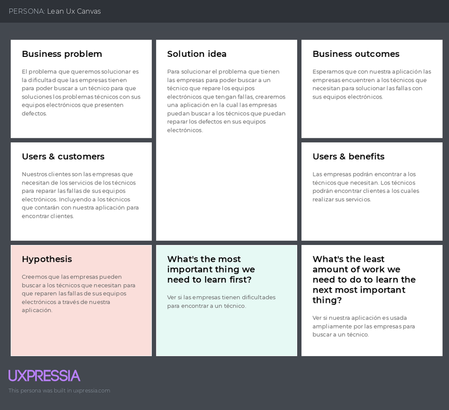
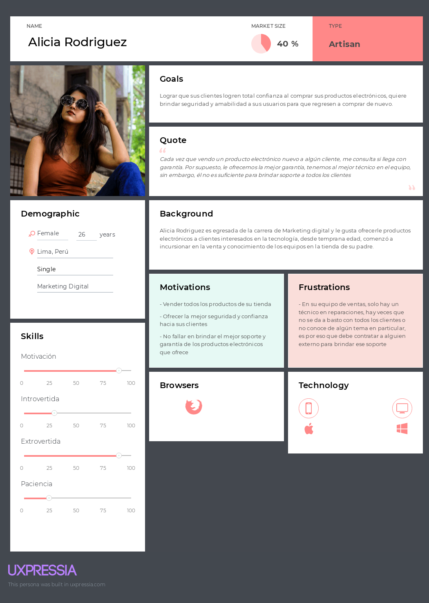
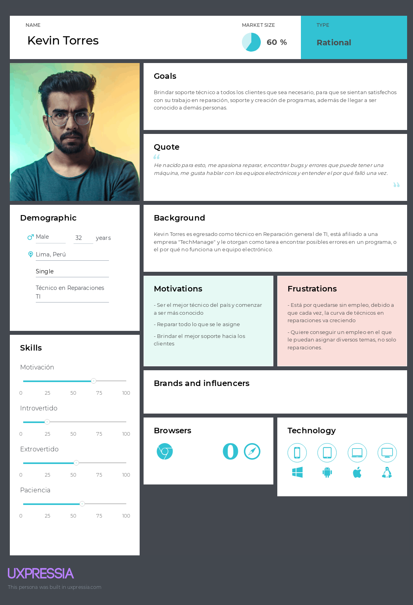
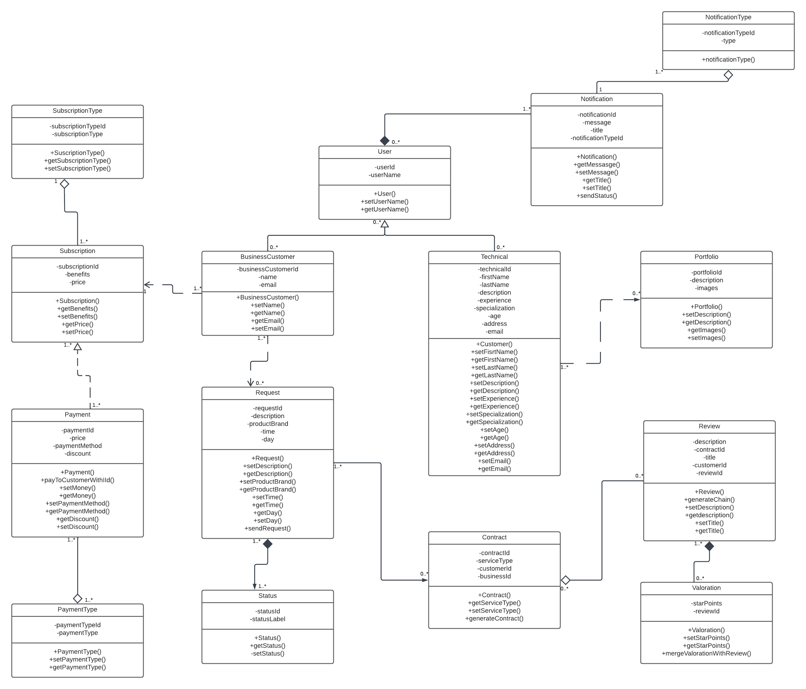
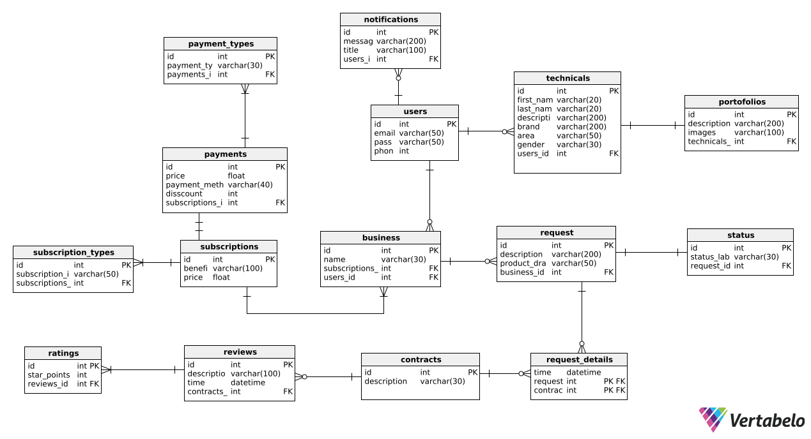
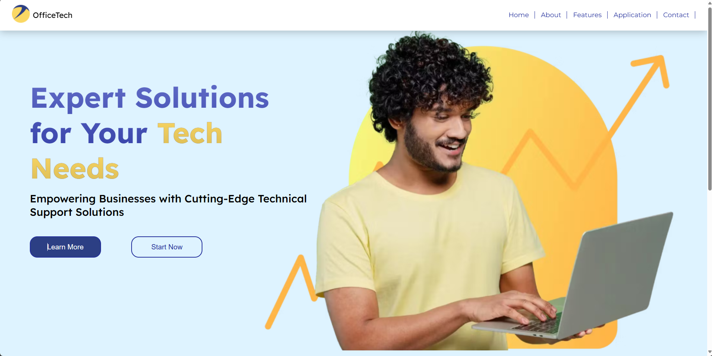
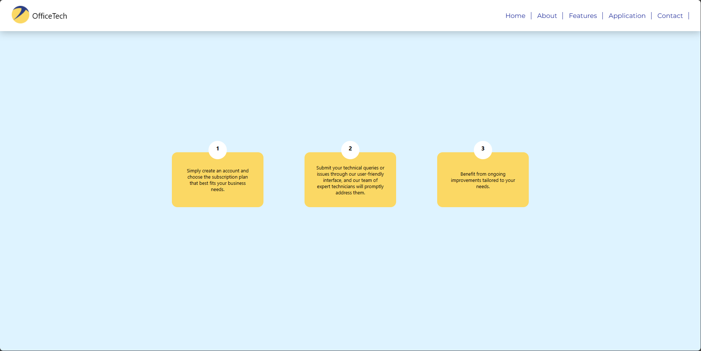

<p align="center">
    <strong>Universidad Peruana de Ciencias Aplicadas</strong><br>
    </img><br>
    <strong>INGENIERÍA DE SISTEMAS DE SOFTWARE</strong><br>
    <strong> SI729 - Desarrollo de Aplicacion Open Source SW53</strong><br>
    <strong>Profesor: Elio Jefferrson Navarrete Vilca </strong><br>
    <br>INFORME <br>
    "TechConnect Solutions" | "OfficeTech"
</p>

### Integrantes:
- Jara Benites, Quique Vladimir - U202022365   
- Herrera Aguirre, Fabia Alejandra - U202219422
- Rodriguez Vargas, Arian Martin - U202212096
- Ramirez Ramirez,Marcelo Sebastian - U202210582
- Ramirez Conteras, Zaid Valentino - U202218472 
- Rubio Calixto, Adrian Gustavo - U202017622 

---
# Registro de Versiones del Informe
| Version | Fecha | Autor | Descripcion de Modificacion |
| ----------- | ----------- | ----------- | ----------- |
| 0.0 | 24/03/2024 | Grupo 3 | Se crea el documento |
| 1.0 | 24/03/2024 | Grupo 3 | Se crean las ramas correspondientes |
| 1.1 | 25/03/2024 | Grupo 3 | Capitulo I |
| 1.1 | 25/03/2024 | Grupo 3 | Capitulo II |
| 1.1 | 27/03/2024 | Grupo 3 | Capitulo III |
| 1.1 | 29/03/2024 | Grupo 3 | Capitulo IV |

# Project Report Collaboration Insights
[URL del repositorio](https://github.com/OpenSourceSW53/-upc-pre-202401-si729-SW53-officetech-report.git)

(Imagenes de los commits cada entrega)


# Student Outcome 3

|Criterio Especifico| Acciones Realizadas                                                                                                                                                                                |Conclusiones|
|-|-----------------------------------------------------------------------------------------------------------------------------------------------------------------------------------------------------------------------------------------------------------------------------------------------------------------------------------------------------------------------------------------------------------------------------------------------------------------------------------------------------------------------------------------------------------------------------------------------------------------------------------------------------------------------------------------------------------------------------------------------------------------------------------------------------------------------------------------------------------------------------------------------------------------------------------------------------------------------------------------------------------------------------------------------------------------------------------------------------------------------------------------------------------------------------------------------------------------------------------------------------------------------------------------------------------------------------------------------------------------------------------------------------------------------------------------------------------------------------------------------------------------------------------------------------------------------|-|
|Comunica oralmente sus ideas y/o resultados con objetividad a público de diferentes especialidades y niveles jerarquicos, en el marco del desarrollo de un proyecto en ingeniería.| Marcelo Ramirez:<br> **TB1:** Durante el proyecto, aprendí a comunicar ideas complejas de forma clara y sencilla a distintas audiencias, lo que mejoró significativamente la colaboración y el interés en nuestro trabajo. Esta experiencia reforzó la importancia de adaptar mi comunicación a diferentes contextos, un aprendizaje valioso para mi futuro profesional. <br><br>Zaid Ramirez:<br>**TB1**: Durante la elaboración del proyecto, logré comunicar de manera efectiva los resultados y el proceso de nuestro proyecto, utilizando Lean UX como marco principal. También compartí los hallazgos esenciales obtenidos a través de nuestra investigación de UX, que permitió comprender a fondo las necesidades de los usuarios, identificar las tareas críticas y visualizar la experiencia completa del usuario con la aplicación.<br><br>Adrian Rubio:<br>**TB1**: Me desarrolle eficazmente en mis tareas designadas, apegándome a los horarios, reglas y plazos establecidos por el equipo. <br><br>Quique Jara:<br>**TB1**: Durante la elaboracion del proyecto logre comunicar todas mis ideas en las reuniones de equipo de manera clara. Asimismo, entreviste a un usuario potencial, al cual explique el motivo de la entrevista y la informacion que necesitaba recopilar. <br><br>Arian Rodriguez:<br>**TB1**: Me desarrollé adecuadamente en las tareas asignadas y mejoré algunas habilidades blandas como la comunicación con el equipo, además que se conoce mejor el proceso a desarrollar para posicionarlo desde diferentes perspectivas<br><br>Fabia Herrera:<br>**TB1:** Se realizaron varias reuniones grupales a fin de intercambiar propuestas para el óptimo desarrollo de nuestro proyecto. Asimismo, realizamos entrevistas mediante las cuales conseguimos insights valiosos para la creación de nuestra aplicación web. |Mediante la eficiencia, organización y el marco de trabajo establecido dentro del grupo logramos desarrollar nuestro primer entregable de manera correcta.|
|Comunica en forma escrita ideas y/o resultados con objetividad a público de diferentes especialidades y niveles jerarquicos, en el marco del desarrollo de un proyecto en ingeniería..| Marcelo Ramirez:<br> **TB1:** En mi rol dentro del proyecto, me esforcé por comunicar ideas y resultados de manera clara y objetiva. Mis contribuciones, desde informes hasta presentaciones, buscaban ser accesibles y comprensibles para todos, un desafío que me enseñó el valor de una comunicación efectiva en el ámbito académico. <br><br> Zaid Ramirez<br>**TB1:** Durante este proyecto, he  documentado adecuadamente el emprendimiento utilizando las herramientas apropiadas, con las convenciones de idioma, la estructura de nombres y prácticas de programación establecidos en los aspectos de la solución. Además, he llevado a cabo y documentado adecuadamente los procesos Lean UX, Design, Prototyping, etc., para la comunicación efectiva con diferentes rangos de audiencia.<br><br>Adrian Rubio:<br>**TB1**: Por medio de las herramientas colaborativas online logre aumentar mi capacidad de comunicación y trabajo en equipo. <br><br>Quique Jara:<br>**TB1**: Para el desarrollo de esta entega, redacte de manera el analisis de requerimientos para luego elaborar la base de datos del sietema y el diagrama de clases. <br><br>Arian Rodriguez:<br>**TB1**: Elaboré mis propuestas planteadas para el proyecto siguiendo el marco de la ingeniería de software, aplicando y viendo a futuro cómo se desenvolvería el proceso<br><br>Fabia Herrera:<br>**TB1:** La indagación realizada para este proyecto fue documentada y de gran ayuda para el modelado de nuestra solución, para esta entrega, me encargué de investigar sobre potenciales competidores, lo que nos resultó útil para aprender tanto de errores como de aciertos.                                                                                                                                                                                                        |Gracias a las herramientas colaborativas brindadas y las aplicaciones de comunicación logramos establecer fechas y límites para nuestros trabajos.|

# Capítulo I: Introducción
## 1.1. Startup Profile
### 1.1.1. Descripción de la Startup
#### TechConnect Solutions
Somos un equipo de desarrolladores de plataformas web con experiencia en servicio técnico, cuyo objetivo es brindar soporte y soluciones a los clientes para satisfacer sus requerimientos y necesidades así como asegurar su completa satisfacción.
Además, utilizamos una variedad de métodos innovadores para resolver los problemas que enfrentan nuestros clientes.
- **Misión:** Nuestra misión es garantizar una experiencia óptima y agradable al usar la aplicación, garantizando la seguridad, confianza y preferencia del cliente.
- **Visión:** Nos esforzamos por penetrar, establecernos y diferenciarnos en el mercado de soporte tecnológico dedicado, ganarnos la confianza del cliente y asegurar una posición sólida en el sector.
#### 1.1.2. Perfiles de integrantes del equipo
| Miembros del equipo                                                                                                                         | Codigo Estudiante | Carrera | Conocimientos / Habilidades              |
|---------------------------------------------------------------------------------------------------------------------------------------------|-------------------|-|------------------------------------------| 
| Jara Benites, Quique Vladimir <br>               | U202022365        |Ingenieria de software| C++, Python, C#, perseverante y creativo |
| Rodriguez Vargas, Arian Martin           | U202212096        |Ingenieria de software| C++, Python, persistente y amigable      |
| Ramirez Contreras, Zaid Valentino                 | U202218472        |Ingenieria de software| C++, python, HTML5, CSS3, Javascript, SQL |
| Herrera Aguirre, Fabia Alejandra             | U202219422        |Ingenieria de software| C++, Python, SQL, creativa, responsable  |
| Ramirez Ramirez, Marcelo Sebstian            | U202210582        |Ingenieria de software| C++, Javascript,SQL,HTML5,CSS      |
| Rubio Calixto, Adrian Gustavo                  | U202017622        |Ingenieria de software| C++, HTML,  CSS,  Java, y  python       |

## 1.2. Solution Profile
### 1.2.1 Antecedentes y problemática
Nuestra plataforma ofrecerá un servicio de suscripción dirigido a empresas que comercializan productos electrónicos. A través de esta suscripción, las empresas tendrán acceso a un plan que incluye una cantidad específica de garantías mediante servicios técnicos. El objetivo es proporcionar un acceso confiable y seguro a estos servicios para empresas, tiendas o profesionales independientes que los requieran.

Además, esta iniciativa creará oportunidades laborales para técnicos especializados en dispositivos electrónicos. Al mismo tiempo, las empresas podrán reducir costos al optar por suscribirse a **OfficeTech** en lugar de mantener su propio equipo de soporte técnico, ya que solo pagarán por el plan seleccionado y los servicios utilizados.
- **¿Qué?**
La problematica se presenta cuando los técnicos especializados en dispositivos electrónicos y tecnología enfrentan dificultades para encontrar empleo debido a la falta de medios para promocionarse en el mercado, lo que resulta en una falta de desarrollo económico sostenible.
- **¿Quién?**
Los técnicos que enfrentan desafíos al no tener una presencia efectiva en las redes sociales para atraer nuevos clientes. Además, algunos técnicos carecen de contactos que puedan recomendar su trabajo, lo que puede llevar a la pérdida de clientes potenciales.
- **¿Por qué?**
La falta de publicidad o recomendaciones por parte de los técnicos limita su capacidad para obtener más trabajo. Además, los clientes a menudo intentan resolver sus problemas técnicos por sí mismos, consultando a amigos o buscando información en redes sociales.
- **¿Dónde?**
En sus hogares, esperando una respuesta o contacto telefónico a través de llamadas o mensajes de WhatsApp. El problema radica en que la espera puede ser prolongada.
- **¿Cuándo?**
Este problema suele manifestarse principalmente por la mañana y por la tarde, momentos en los que los técnicos reciben pocas llamadas.
- **¿Cómo?**
La calidad del servicio y el tiempo de respuesta son los aspectos más importantes para los clientes a la hora de evaluar un trabajo. La frecuencia del problema sigue un patrón en el que los clientes prefieren a técnicos o empresas que les brinden mayor seguridad y confianza, lo que puede demostrarse mediante un historial de proyectos o referencias positivas.
- **¿Cuánto?**
Los problemas surgen en días en los que no hay o hay poco contacto con los clientes, lo que afecta los ingresos y el tiempo perdido. Los ingresos de los técnicos varían según las circunstancias de cada cliente, pudiendo limitarse a una simple revisión técnica.
### 1.2.2 Lean UX Process.
#### 1.2.2.1. Lean UX Problem Statements.
##### **Empresa:**
Según una investigación realizada por ManpowerGroup en 2017, se encontró que el 46% de los empleadores enfrentan dificultades para llenar sus vacantes. Esta dificultad radica en la escasez de técnicos de calidad, cuya especialización requiere evaluar tanto habilidades técnicas como habilidades blandas en un corto período de tiempo para satisfacer las demandas de los usuarios.

Nos hemos dado cuenta de las limitaciones de las empresas para ofrecer garantías a sus clientes debido a la falta de técnicos especializados en equipos electrónicos y tecnología, lo cual resulta en dificultades para cubrir vacantes.

¿Cómo podemos mejorar la eficiencia en el proceso de búsqueda de técnicos de equipos electrónicos y tecnología?

##### **Técnico**:
Los profesionales en tecnología enfrentan desafíos para atraer nuevos clientes, lo que provoca retrasos en sus ingresos y pérdida de tiempo. Se encuentran con obstáculos al intentar destacar en redes sociales que no están específicamente diseñadas para su sector, especialmente cuando existen empresas bien establecidas que transmiten mayor seguridad al cliente en cuanto a la calidad del servicio.

Hemos identificado la necesidad de un intermediario que pueda comunicar el desempeño laboral de los técnicos a sus clientes para aumentar su base de clientes.
#### 1.2.2.2. Lean UX Assumptions.
**Business Assumptions**
- Creemos que nuestros clientes necesitan una aplicacion que les facilite buscar un trabajador capacitado que se encargue adecuadamente de los equipos electronicos.
- El trabajador recibe una notificacion cuando alguien requiere un servicio.
- Mis clientes son capaces de utilizar plataformas moviles
- El cliente es atendido en brevedad
- El cliente puede contactar con los tecnicos mediante una llamada telefonica
- Nuestros clientes inicales son contactados por medio de redes sociales, mientras que las empresas por reuniones pactadas.
- Generamos ingresos mediante suscripciones con las empresas por garantia.
- Nuestra principal competecia son las aplicaiones web que funcionan como intermediarios entre trabajadores y clientes
- Ganaremos a la competencia al contar con la supervicion del rendimiento que dan los tecnicos
- Nuestro mayor riesgo es que los clientes busquen un tecnico por su cuenta

**User Assumptions**
- ¿Quién es el usuario?
  <br/>Las empresas que solicitan servicio tecnico mediante nuestra aplicacion
- ¿Dónde encaja nuestro producto en su trabajo
  <br/>En cualquier momento que tenga dificultad con su equipo y quiera una solucion rapida
- ¿Qué problemas tiene nuestro producto? ¿Resolver?
  <br/>El algoritmo para que todos las personas que brindan servicio tecnico puedan generar ingresos. Se podria resolver a traves de filtros y comentarios
- ¿Cuándo y cómo es nuestro producto? ¿Usado?
  <br/>El producto es utilizado cuando se tiene una necesidad o deseo de reparar algún equipo
  electrónico para que no le interrumpa su trabajo. Asimismo, establecer comunicaciones
  con las personas que puedan brindar el servicio. Por otro lado, el producto debe verse
  confiable y formal para brindarle seguridad al cliente
- ¿Qué características son importantes?
  <br/>La comunicacion sencilla entre cliente y trabajador. Asimisnmo, el acceso a una gran variedad de tecnicos
- ¿Cómo debe verse y comportarse nuestro producto?
  <br/>Nuestro producto debe verse confiable y funcional diariamente. Este debe comportarse
  de forma amigable con una funcionalidad ágil, para que los usuarios no tengan
  problemas para usarlo

#### 1.2.2.3. Lean UX Hypothesis Statements.
| Assumption priorizado: | 1 (Business Assumptions)                                                                                                                                           |
|------------------------|--------------------------------------------------------------------------------------------------------------------------------------------------------------------|
| Hypothesis:            | 1                                                                                                                                                                  |
| Descripcion:           | Creemos que nuestros clientes podran solucionar el problema de buscar un tecnico con nuetrsa asplicacion<br/>Sabemos que nuestros clientes encontrarán al tecnico  |
| Metrica                | Crearemos una aplicación para buscar técnicos                                                                                                                      |

| Assumption priorizado: | 4 (Business Assumptions)                                                                                         |
|------------------------|------------------------------------------------------------------------------------------------------------------|
| Hypothesis:            | 2                                                                                                                |
| Descripcion:           | Creemos que nuestros clientes podrán ahorrarse el tiempo de esperar a un técnico para que solucione su problema.<br/>Sabemos que nuestros clientes no podrán esperar mucho tiempo para conseguir un técnico |
| Metrica                | Las notificaciones de solicitudes de servicio llegarán a los técnicos en cuestión de segundos                    |

| Assumption priorizado: | 5 (Business Assumptions)                                                                                                                                              |
|------------------------|-----------------------------------------------------------------------------------------------------------------------------------------------------------------------|
| Hypothesis:            | 3                                                                                                                                                                     |
| Descripcion:           | Creemos que nuestros clientes se podran comunicar con los tecnicos por medio de via telefonica<br/>Sabemos que los clientes van a querer comunicarse con los tecnicos |
| Metrica                | El numero de celular del tecnico aparecera en la informacion de su perfil                                                                                             |

| Assumption priorizado: | 3 (Business Assumptions)                                                                                                                       |
|------------------------|------------------------------------------------------------------------------------------------------------------------------------------------|
| Hypothesis:            | 4                                                                                                                                              |
| Descripcion:           | Creemos que nuestra aplicación podrá garantizar que los técnicos puedan tener ingresos.<br/>Sabemos que los tecnicos buscan un trabajo estable |
| Metrica                | Los tecnicos obtendran sus ganancias al terminar con sus servicios y dependen del tipo de suscripcion de su cliente y calificacion             |

| Assumption priorizado: | 6 (Business Assumptions)                                                                                                                                                                                            |
|------------------------|---------------------------------------------------------------------------------------------------------------------------------------------------------------------------------------------------------------------|
| Hypothesis:            | 5                                                                                                                                                                                                                   |
| Descripcion:           | Creemos que nuetra aplicacion tendra un buen funcionamiento y que los usuarios puedan usarlo facilmente<br/>Sabemos que nuestros usuarios quieren una aplicacion que sea facil de usar y que funcione correctamente |
| Metrica                | Se crearan funcionalidades que sean amigables para los usuarios                                                                                                                                                     |

#### 1.2.2.4. Lean UX Canvas.


## 1.3. Segmentos objetivo.
**Segmento 1**
<br>Clientes: Empresas, organizaciones, tiendas o vendedores independientes de aparatos electrónicos, tecnológicos o electrodomésticos, que necesit an de un servicio confiable, seguro y eficaz de soporte técnico para cubrir las garantías de sus productos vendidos.

**Segmento 2** 
Técnicos especializados en el servicio de reparación de distintos artefactos electrónicos, tecnológicos o electrodomésticos. Además, que gusten afiliarse en la aplicación para aumentar su alcance laboral y tener más opciones de trabajo

---
# Capítulo II: Requirements Elicitation & Analysis
## 2.1. Competidores.
### 2.1.1. Análisis competitivo.

| Competitive Analysis Landscape                          |  |
| ------------------------------------------------------- | -|
| ¿Por qué llevar a cabo este análisis?                   | Llevamos a cabo este análisis inicial para comprender el mercado en el que ingresamos, lo que nos permite evaluar las estrategias implementadas por plataformas ya establecidas. De esta manera, buscamos aprender tanto de sus éxitos como de sus fracasos. |


| |  | OfficeTech | JustAnswer  | Compupalace |
|-|-|-|-|-|
| PERFIL| Overview | OfficeTech proporciona acceso rápido y confiable a servicios técnicos, permitiendo a las empresas reducir costos al evitar la necesidad de mantener un equipo interno de soporte. | Plataforma en línea que conecta a usuarios con expertos verificados en una variedad de campos, incluyendo tecnología y electrónica. | Empresa peruana que ofrece servicios integrales de soporte técnico y soluciones informáticas para empresas y usuarios individuales. |
|| Ventaja competitiva ¿Qué valor ofrece a los clientes? |  - Reducción de costos para las empresas que contraten nuestros servicios.<br>- Garantizamos servicios técnicos de calidad confiable. | - Facilita el acceso a expertos verificados.<br>- Cuenta con una gran variedad temas en los que brindan asistencia, desde asistencia legal hasta tecnología.  | - Reputación como proveedor confiable de servicios informáticos.<br>- Amplia gama de servicios, incluyendo reparación y mantenimiento de equipos.|
|| Mercado Objetivo                                        | - Empresas que necesitan un soporte técnico confiable para satisfacer las necesidades de sus clientes.<br>- Profesionales en tecnología enfrentan desafíos para atraer nuevos clientes | Usuarios individuales y empresas que buscan respuestas especializadas en una gran variedad de campos. | Usuarios individuales en Perú que requieren servicios de reparación, mantenimiento y asistencia técnica para sus equipos. |
| Perfil de marketing                                     | Estrategia de Marketing | - Campañas dirigidas a gerentes de empresas de tecnología y electrónica.<br>- Participación en ferias comerciales y eventos.<br>- Publicidad en línea | - Publicidad en línea y en redes sociales.<br>- Colaboraciones con sitios web y blogs relevantes. | - Publicidad en medios de comunicación tradicionales. |
| Perfil del producto                                     | Productos y servicios | Plataforma de suscripción para servicios técnicos.  | Plataforma en línea de preguntas y respuestas con expertos.| Servicio presencial de venta de productos electrónicos y soporte técnico. |
|| Precios y costos                                        | Variable según la complejidad del servicio y el técnico. | Costo mensual por suscripción. | Variable según la complejidad del servicio y el técnico. |
|| Canales de distribución (Web y/o Móvil)                 | Web y Móvil Web | Web y Móvil Web | Servicio presencial |

### 2.1.2. Estrategias y tácticas frente a competidores.

|Competidores ->|  | OfficeTech |JustAnswer| Compupalace|
|-|-|-|-|-|
| Análisis SWOT | Fortalezas | - Reduce costos a las empresas al evitarles mantener un equipo interno de soporte técnico.<br>- Garantizamos servicios técnicos confiables y de alta calidad. | - Cuenta con una red de expertos verificados en una amplia gama de campos.<br>- Permite obtener asesoramiento experto de manera rápida y conveniente. | - Ofrece una amplia variedad de servicios informáticos integrales.<br>- Cuenta con una reputación como un proveedor confiable de servicios informáticos. |
|| Debilidades   | - Competencia en el mercado al tener que enfrentarse a empresas similares sedimentadas.<br>- Garantizar la fiabilidad de los proveedores de servicios técnicos. | - Calidad variable según el experto que responda la pregunta.<br>- Dependencia de la disponibilidad de expertos en línea para absolver dudas. | Al ofrecer un servicio exclusivamente presencial su alcance de mercado está limitado por su geografía. | lorem | 
|| Oportunidades | Expansión del alcance para atender en otras áreas que requieren soporte técnico especializado. | Expansión de su plataforma a nuevos mercados internacionales. | Diversificar sus servicios para incluir soluciones adicionales, como seguridad cibernética o desarrollo de software. | lorem | 
|| Amenazas      | La captación y retención de clientes podría llegar a ser dificultosa y competitiva debido a la presencia de grandes empresas establecidas. | La calidad variable de las respuestas proporcionadas por los expertos podría generar desconfianza entre los usuarios. | La rápida evolución de la tecnología podría hacer que sus servicios se vuelvan obsoletos si no se mantienen al día con las últimas tendencias. | lorem |

## 2.2. Entrevistas.
### 2.2.1. Diseño de entrevistas.
**Preguntas generales:**

1. ¿Cuál es su nombre? 
2. ¿Qué edad tiene? 
3. ¿A qué se dedica? 


**Preguntas a empresas que necesitan soporte técnico:**
1.	¿Cuáles son los principales desafíos que enfrenta su empresa en términos de soporte técnico?
2.	¿Con qué frecuencia experimenta problemas técnicos que afectan la operación de su empresa?
3.	¿Qué tipo de servicios técnicos considera más críticos para su negocio?
4.	¿Qué criterios utiliza para evaluar y seleccionar proveedores de soporte técnico?
5.	¿Ha considerado la posibilidad de externalizar el soporte técnico en lugar de mantener un equipo interno?
6.	¿Qué métodos ha utilizado al buscar profesionales para reparar sus dispositivos (páginas web, referencias, anuncios físicos, etc.)?
7.	¿Qué experiencias positivas o negativas ha tenido con proveedores de soporte técnico en el pasado?
8.	¿Qué tipo de tecnologías o equipos utilizan en su empresa que requieren soporte técnico regular?
9.	¿Qué tan crítico es el tiempo de respuesta para resolver problemas técnicos en su negocio?

   
**Preguntas a profesionales en tecnología:**
1.	¿Cuáles son los mayores desafíos que enfrenta al intentar atraer nuevos clientes a su negocio?
2.	¿Qué canales de comunicación prefiere utilizar para llegar a sus clientes potenciales? (Redes sociales, correo electrónico, eventos de networking, etc.)
3.	¿Qué tipo de servicios o soluciones tecnológicas ofrece a sus clientes potenciales?
4.	¿Qué métodos utiliza habitualmente para abordar los problemas técnicos planteados por sus clientes? (en línea, asesoramiento telefónico, visitas presenciales, acceso remoto a los dispositivos, etc.) 
5.	¿Cómo describiría un día típico en su trabajo?
6.	¿Cuál es un desafío habitual que enfrenta al tratar con sus clientes? ¿Cómo suele manejar esta situación cuando surge?

### 2.2.2. Registro de entrevistas.
**Segmento 1**  
Nombre: Rusbel Bargas
Edad: 37 años 
Ocupación: Ing.Informatico  


**Segmento 2**  
Nombre: David Beltran Burgos
Edad: 23 años 
Ocupación: Soporte TI

La entrevista fue realizada a David Beltrán, un técnico de reparación en el área de TI, que se encarga de dar soporte y mantenimiento a dispositivos de empresas. Beltrán menciona que uno de los mayores desafíos es atraer nuevos clientes, dada la competencia y la variedad de servicios que ofrecen empresas mas grandes y consolidadas. Utiliza principalmente LinkedIn, Instagram y Facebook como canales de comunicación para llegar a sus clientes potenciales. Sus servicios incluyen actualización de equipos de cómputo, reparaciones y soporte para sistemas remotos como Azure y AWS. Para abordar los problemas técnicos, Beltrán puede ofrecer servicios de manera remota o presencial dependiendo del problema. Varias veces tiene que trabajar bajo presion, pues las empresas le exigen que termine rapido. Maneja estas situaciones explicando el tiempo estimado que llevará resolver el problema y brindando justificaciones si es necesario. La entrevista concluyó con la posibilidad de requerir feedback en el futuro y agradecimientos mutuos.

### 2.2.3. Análisis de entrevistas.
**Segmento 1:**
{texto}
**Segmento 2:**
{texto}
## 2.3. Needfinding.
### 2.3.1. User Personas.
**Segmento 1:** Clientes que requieren de un plan para soporte técnico que brinde garantía y soluciones a sus productos electrónicos vendidos.  


**Segmento 2:** Técnicos especializados en reparación, mantenimiento y soporte técnico de productos electrónicos.


### 2.3.2. User Task Matrix.
**Segmento 1:** 

|  |  User 1  | User 2 | User 3  | User 4 |
| --- | ----------- | ------------ | ----------- | ---------- |
| Es dueño o vende productos electrónicos  | <span style="color:#90D26D; font-weight:bold">SI</span>   | <span style="color:#FFC700; font-weight:bold">POCO</span>| <span style="color:#90D26D; font-weight:bold">SI</span>   | <span style="color:#90D26D; font-weight:bold">SI</span> |
| Cuenta con un equipo de soporte técnico para brindar garantía | <span style="color:#FFC700; font-weight:bold">POCO</span> | <span style="color:#E72929; font-weight:bold">NO</span>        | <span style="color:#FFC700; font-weight:bold">POCO</span>         | <span style="color:#E72929; font-weight:bold">NO</span>       |
| Contrata a técnicos externos para temas en específico | <span style="color:#90D26D; font-weight:bold">SI</span> | <span style="color:#90D26D; font-weight:bold">SI</span>        | <span style="color:#FFC700; font-weight:bold">POCO</span>         | <span style="color:#90D26D; font-weight:bold">SI</span>       | 
| Brinda soporte técnico a sus clientes como parte de garantía a sus productos vendidos | <span style="color:#FFC700; font-weight:bold">POCO</span> | <span style="color:#FFC700; font-weight:bold">POCO</span>        | <span style="color:#FFC700; font-weight:bold">POCO</span>         | <span style="color:#E72929; font-weight:bold">NO</span>       |

**Segmento 2:** 

|  |  User 1  | User 2 | User 3  | User 4 |
| --- | ----------- | ------------ | ----------- | ---------- |
| Es técnico de especialidad  | <span style="color:#90D26D; font-weight:bold">SI</span>   | <span style="color:#90D26D; font-weight:bold">SI</span>| <span style="color:#90D26D; font-weight:bold">SI</span>   | <span style="color:#90D26D; font-weight:bold">SI</span> |
| Cuenta con un empleo seguro y rentable | <span style="color:#E72929; font-weight:bold">NO</span> | <span style="color:#E72929; font-weight:bold">NO</span>        | <span style="color:#FFC700; font-weight:bold">POCO</span>         | <span style="color:#E72929; font-weight:bold">NO</span>       |
| Conoce de todos los temas para reparar y dar soporte | <span style="color:#90D26D; font-weight:bold">SI</span> | <span style="color:#90D26D; font-weight:bold">SI</span>        | <span style="color:#FFC700; font-weight:bold">POCO</span>         | <span style="color:#90D26D; font-weight:bold">SI</span>       | 
| Le gusta brindar soporte técnico | <span style="color:#90D26D; font-weight:bold">SI</span> | <span style="color:#90D26D; font-weight:bold">SI</span>        | <span style="color:#90D26D; font-weight:bold">SI</span>         | <span style="color:#90D26D; font-weight:bold">SI</span>       |
### 2.3.3. User Journey Mapping.
**Cliente:**


**Técnico:**  


### 2.3.4. Empathy Mapping.
**Cliente:**


**Técnico:**  


### 2.3.5. As-is Scenario Mapping.

**Cliente:**  


| **Phases**    | Busco Servicio Técnico| Contacto con la persona que me hara el servicio | Contrato y pago el producto | Recibo mi producto reparado |
|----------|--------|--------|--------|--------|
| **Doing**    | -Navego en la web buscando soporte técnico. <br> -Consulto a amigos o familiares por algún técnico conocido. |  -Le explico el problema que presento. <br> -Llamo y pregunto si me puede realizar el trabajo. | -Llego a un acuerdo con el técnico y lo contrato. <br> -Cancelo el pago del servicio.| -Recibo mi producto ya reparado. <br> Reviso si mi producto se encuentra correctamente. |
| **Thinking** | -Espero poder encontrar un buen técnico. <br> -Pienso que ojalá el servicio no cueste mucho dinero. | Pienso que ojalá el servicio no cueste mucho dinero. | -Si realizo un buen trabajo, el costo valdrá la pena. <br> -Espero que no sea una estafa. | -Pienso que se hizo un buen trabajo. <br> -Espero que no presente más fallas. |
| **Feeling**  | -Siento estresado porque debo pasar mucho tiempo buscando soporte confiable por internet. | -Angustia porque no conozco a la persona y necesito que repare mi producto. | -Temor por ser estafado, ya que soy un vendedor nuevo. <br> -Esperanza porque el trabajo sea correcto. | -Alegre, ya que resolvieron mi problema. <br> -Felicidad porque todo salió bien. |

**Técnico:**  
            

| **Phase**     | Busca un cliente con problemas | Analiza el producto a realizar el servicio | Realizo el presupuesto | Realiza el servicio lo mejor posible |
|---------------|--------------------------------|-------------------------------------------|------------------------|------------------------------------|
| **Doing**     | Hablo con el cliente sobre su caso | Coordinamos un precio accesible          | Realizo el mantenimiento | Se realiza el pago del servicio    |
| **Thinking**  | Espero poder encontrar nuevos clientes | Espero que mis capacidades sean suficientes | Espero poder ser mas conocido por mi servicio | Espero que me valoren bien mis clientes |
| **Feeling**   | Siento que no soy muy popular   | Siento que no tengo muchos clientes       | Siento que no valoran mis capacidades | Siento que tengo mucho tiempo sin los |


## 2.4. Ubiquitous Language.

| **Terms and Definitions** | **Términos y Definiciones** |
|---------------------------|-----------------------------|
| Technical Support         | Servicio ofrecido para solucionar problemas relacionados con el hardware o software de dispositivos electrónicos. |
| Service Request           | Petición realizada por un usuario o empresa para recibir asistencia técnica. |
| Technician                | Profesional especializado en el mantenimiento y reparación de dispositivos electrónicos. |
| User                      | Cualquier persona o entidad que utiliza la plataforma para solicitar o proveer servicios técnicos. |
| Device                    | Cualquier pieza de equipo electrónico que requiera mantenimiento o reparación. |
| Subscription Plan         | Modelo de pago que permite a los usuarios acceder a servicios específicos durante un periodo determinado. |
| Service History           | Registro de todas las solicitudes de servicio y asistencias técnicas realizadas a través de la plataforma. |
| Feedback                  | Opiniones o comentarios proporcionados por los usuarios sobre la calidad del servicio recibido. |
| Issue                     | Descripción de la falla o mal funcionamiento que un dispositivo está experimentando. |
| Warranty                  | Compromiso de reparar o reemplazar un dispositivo dentro de un período específico, sin costo adicional. |


---

# Capítulo III: Requirements Specification
## 3.1. To-Be Scenario Mapping.

**Cliente:** 

| Fases | Busco un servicio tecnico | Me pongo en contacto con el | Lo contrato y realizo pago  | Espero y su llega para la reparacion | El tecnico llega y soluciona mi problema|
|----------|-------------------------------------------------------|---------------------------------------------------|-------------------------------------------------|---------------------------------------------------|--------------------------------------------------|
| Doing    | Decirle al tecnico sobre la situacion | Consultar al técnico sobre mantenimiento o cuidados posteriores | Programar servicios futuros basados en necesidades recurrentes | Recomendar el técnico a otros usuarios dentro de la plataforma. | Compartir mi experiencia con el servicio en redes sociales o con amigos. |
| Thinking | Espero que el trabajo se realize con exito | Espero que phaber pagado demas por la subcripcion valga la pena  | Espero que el problema no sea nada grave | Pienso que el tecnico debe ser bueno e su trabajo | Pienso que es un alivo haber encontrado esta plataforma |
| Feeling  | Feliz de poder aver arreglado el problema | Confiado en que lo va a solucionar | Esperanzado de que el problema no sea grave | Aliviado de que la plataforma es confiable. | Contento de que todo haya salido bien.    |

**Técnico:** 

| Fases | Espero notificacion de servicio | Recibo un reporte de servicio tecnico y acepto| Realizo y resuelvo el problema del cliente  | El cleinte realiza el pago del servico por medio de un pago | El cliente valora mi servicio atraves de reseña |
|----------|-------------------------------------------------------|---------------------------------------------------|-------------------------------------------------|---------------------------------------------------|--------------------------------------------------|
| Doing    | Realizo el servicio adecuardo a las indicaciones del cliente | Responder a solicitudes de servicio, enviar cotizaciones. | Acordar detalles del servicio, comenzar el trabajo técnico. | Hago  un seguimiento post-servicio | Explorar nuevas áreas de servicio, actualizar el perfil con nuevos skills. |
| Thinking | Esto podría expandir mi alcance a más clientes.    | Dejo a clientes satisfechos  | Subi mi calificacion como tecnico. | Conocer la opinión del cliente para mejorar. | Puedo aumentar mi oferta de servicios para atraer a más clientes |
| Feeling  | Optimista y curioso por mi potencial crecimiento. | Motivado ante la posibilidad de nuevos trabajos. | Responsabilidad y compromiso con la calidad.   | Satisfecho por el trabajo bien hecho y deseo de mejorar . | Ambición y deseo de crecimiento profesional.    |


## 3.2. User Stories.

| USER STORY ID | TITULO | DESCRIPCION|
|------|----------------------------------|------------------------------------------------------------------------------------------------------------------------------------------------------------|
| HU01 | Registro fácil en la plataforma | "Como usuario, deseo registrarme fácilmente en la plataforma para empezar a ofrecer o buscar servicios, para evitar procesos complicados y comenzar rápidamente." |
| HU02 | Destacar habilidades en el perfil | "Como usuario, deseo una forma de destacar mis habilidades especiales en mi perfil, para atraer a otros usuarios que busquen esos servicios específicos."  |
| HU03 | Acceso a planes de servicios | "Como usuario, deseo suscribirme a un plan que se ajuste a mis necesidades de servicios técnicos, para gestionar mejor mis gastos mensuales en la plataforma." |
| HU04 | Sistema de valoraciones | "Como usuario, requiero un sistema para valorar los servicios recibidos y proporcionar feedback, para ayudar a mejorar la calidad de los servicios ofrecidos."  |
| HU05 | Notificaciones de oportunidades | "Como usuario, deseo recibir notificaciones de oportunidades nuevas que coincidan con mis intereses, para poder responder rápidamente." |
| HU06 | Comunicación segura con usuarios | "Como usuario, necesito una forma de comunicarme de manera segura y eficaz con otros usuarios, para intercambiar detalles sobre los servicios de manera confiable." |
| HU07 | Historial de servicios | "Como usuario, deseo tener acceso a un historial de mis servicios para poder rastrear garantías y trabajos anteriores, para una mejor gestión personal." |
| HU08 | Consejos para mejorar perfil | "Como usuario, requiero consejos y recursos para mejorar mi perfil y aumentar mi visibilidad en la plataforma, para atraer a más usuarios interesados en mis servicios." |
| HU09 | Gestión de múltiples suscripciones | "Como usuario, deseo tener la capacidad de gestionar múltiples suscripciones desde mi cuenta, para facilitar el manejo de diferentes servicios." |
| HU10 | Comparación de servicios | "Como usuario, necesito una manera de comparar servicios y cotizaciones fácilmente, para tomar decisiones informadas al seleccionar servicios." |
| HU11 | Programación anticipada de servicios | "Como usuario, deseo programar servicios con anticipación, para asegurar la disponibilidad cuando los necesite."  |
| HU12 | Acceso a calendario de servicios | "Como usuario, necesito acceder a un calendario que muestre mis servicios programados, para organizar mejor mi tiempo."  |
| HU13 | Recomendaciones personalizadas | "Como usuario, deseo recibir recomendaciones personalizadas basadas en mis intereses y necesidades anteriores, para encontrar servicios adecuados más rápidamente." |
| HU14 | Ofertas y promociones personalizadas | "Como usuario, quiero recibir ofertas y promociones personalizadas, para aprovechar descuentos en servicios que me interesan."|
| HU15 | Informes de uso de servicios | "Como usuario, deseo recibir informes detallados sobre mi uso de servicios en la plataforma, para optimizar mi selección y gastos en servicios futuros."|


## 3.3. Impact Mapping.


## 3.4. Product Backlog.

| #Orden | User Story ID | Título| Descripción  | Story Points (1/2/3/5/8) |
|--------|---------------|------------------------------|-----------------------------------------------------------------------------------------------------------------------------------------|-------------------------|
| 1 | HU01 | Registro fácil en la plataforma | "Como usuario, deseo registrarme fácilmente en la plataforma para empezar a ofrecer o buscar servicios, para evitar procesos complicados y comenzar rápidamente." | 3 |
| 2 | HU02| Destacar habilidades en el perfil | "Como usuario, deseo una forma de destacar mis habilidades especiales en mi perfil, para atraer a otros usuarios que busquen esos servicios específicos." | 5 |
| 3 | HU03 | Acceso a planes de servicios    | "Como usuario, deseo suscribirme a un plan que se ajuste a mis necesidades de servicios técnicos, para gestionar mejor mis gastos mensuales en la plataforma." | 5 |
| 4 | HU04 | Sistema de valoraciones         | "Como usuario, requiero un sistema para valorar los servicios recibidos y proporcionar feedback, para ayudar a mejorar la calidad de los servicios ofrecidos." | 3 |
| 5 | HU05 | Notificaciones de oportunidades | "Como usuario, deseo recibir notificaciones de oportunidades nuevas que coincidan con mis intereses, para poder responder rápidamente." | 2 |
| 6 | HU06 | Comunicación segura con usuarios| "Como usuario, necesito una forma de comunicarme de manera segura y eficaz con otros usuarios, para intercambiar detalles sobre los servicios de manera confiable." | 3 |
| 7 | HU07 | Historial de servicios          | "Como usuario, deseo tener acceso a un historial de mis servicios para poder rastrear garantías y trabajos anteriores, para una mejor gestión personal." | 2 |
| 8 | HU08 | Consejos para mejorar perfil    | "Como usuario, requiero consejos y recursos para mejorar mi perfil y aumentar mi visibilidad en la plataforma, para atraer a más usuarios interesados en mis servicios." | 3 |
| 9 | HU09 | Gestión de múltiples suscripciones | "Como usuario, deseo tener la capacidad de gestionar múltiples suscripciones desde mi cuenta, para facilitar el manejo de diferentes servicios." | 5 |
| 10 | HU10 | Comparación de servicios        | "Como usuario, necesito una manera de comparar servicios y cotizaciones fácilmente, para tomar decisiones informadas al seleccionar servicios." | 3 |
| 11 | HU11 | Programación anticipada de servicios | "Como usuario, deseo programar servicios con anticipación, para asegurar la disponibilidad cuando los necesite." | 3 |
| 12 | HU12 | Acceso a calendario de servicios | "Como usuario, necesito acceder a un calendario que muestre mis servicios programados, para organizar mejor mi tiempo." | 2 |
| 13 | HU13 | Recomendaciones personalizadas | "Como usuario, deseo recibir recomendaciones personalizadas basadas en mis intereses y necesidades anteriores, para encontrar servicios adecuados más rápidamente." | 5 |
| 14 | HU14 | Ofertas y promociones personalizadas | "Como usuario, quiero recibir ofertas y promociones personalizadas, para aprovechar descuentos en servicios que me interesan." | 3 |
| 15 | HU15 | Informes de uso de servicios    | "Como usuario, deseo recibir informes detallados sobre mi uso de servicios en la plataforma, para optimizar mi selección y gastos en servicios futuros." | 5 |

---

# Capítulo IV: Product Design
## 4.1. Style Guidelines.
### 4.1.1. General Style Guidelines.


#### LENGUAJE
El lenguaje que tratamos de expresar en nuestra aplicación es un lenguaje **Formal/Casual**. **Formal**, para transmitir confianza al usuario de que nuestra aplicación le ayudará a resolver su necesidad, y **casual**, ya que tenemos como meta que el usuario lo use en su día a día, dándole un entorno casual a la aplicación, el usuario no se saturará de usarla frecuentemente.

#### COLORES OFFICETECH
En el siguiente cuadro está la paleta de colores que se usará tanto en la Landing Page como para la Web Application. Escogimos el color `#2C3F84` que es una variedad de azul oscuro para dar una identidad de confianza y elegancia, ya que nuestra aplicación tiene que dar ese aspecto para que nuestros usuarios se sientan seguros y cómodos con su uso. También optamos por el color `#FBD864`, un color asociado a la abundancia, la prosperidad y el bienestar. Asimismo, usamos `#232F9B`, color ligeramente más vibrante a nuestro color principal para poder resaltar elementos importantes. Por último, el color `#FFFFFF` lo usamos para proporcionar contraste con los demás colores.


#### Tabla de la paleta de colores para la implementación del Landing page y Web Application de Officetech

| Color   | Descripción                              |
|---------|------------------------------------------|
| #2C3F84 | Azul oscuro: Resalta elementos importantes y crea un sentido de estabilidad y confianza.       |
| #FBD864 | Amarillo: Resalta llamadas a la acción, botones importantes o información relevante. |
| #232F9B | Azul vibrante: Proporciona sofisticación a la página y aporta profundidad.               |
| #FFFFFF | Blanco: Ayuda a crear un aspecto moderno y profesional, al mismo tiempo que mejora la legibilidad del texto y la visibilidad de los elementos clave. |

<center></center>
<br></br>

#### TYPOGRAPHY
La fuente que se utilizará para el texto, título y demás elementos para la aplicación móvil es "Lexend Deca" y sus derivados. El diseñador **Thomas Jocking** es la persona que desarrolló esta fuente, con el objetivo de mejorar la legibilidad en pantalla, lo que la hace ideal para el contenido web. Su diseño equilibrado y proporciones cuidadosamente ajustadas hacen que el texto sea fácil de leer, incluso en tamaños pequeños. Por estos motivos,  escogimos utilizar esta fuente para nuestra **Web Application & Landing Page**, ya que combina legibilidad, profesionalismo y versatilidad.
<br></br>
<center></center>
<br></br>

#### SPACING
Se definió usar un espaciado alto entre cada objeto, ya que con esto buscamos no saturar la vista del usuario y poder dar una aplicación más legible y amigable de usar.


<br></br>

#### BRANDING  
<center></center>
<br></br>

Se escogió este diseño para el logo de "OfficeTech" porque encapsula una estética minimalista y tecnológica que representa bien una compañía especializada en soluciones técnicas para oficinas.

El color azul es profesional y transmite confiabilidad y conocimiento técnico, mientras que el detalle amarillo agrega contraste y visibilidad. Además, el diseño es lo suficientemente simple y distintivo para ser reconocible a pequeñas escalas, lo cual es vital para diferentes aplicaciones, ya sea en línea, en impresiones o en mercancía.

La tipografía es clara y directa, facilitando la lectura y el reconocimiento de la marca. La composición general del logo es equilibrada y simétrica, lo cual es agradable a la vista y comunica estabilidad y precisión, cualidades deseables para una empresa de tecnología.


### 4.1.2. Web Style Guidelines.
Descripcion de los elementos que se utilizaran en el web app

#### Dimensiones
Para desarrollar tanto el landing page como la aplicación web tendremos en cuenta las dimensiones estándar.
- **Escritorio:** 1280 px (ancho)
- **Tablet:** 760 px (ancho)
- **Celular:** 480 px (ancho)

Las medidas en píxeles del alto son relativas, ya que depende del tamaño y el contenido a mostrar.

#### Navegación
La navegación a utilizar será implementada con un enfoque minimalista en donde, para resaltar la sección en la que se encurntra el usaurio, se usará el nombre de la sección se resaltará en **bold**.

<center></center>

#### Iconos
Estos son los iconos que usaremos para la sección de contacto del landing page.

<center></center>

Estos son los iconos que usaremos para facilitar y decorar la navegación en la aplicación web.


#### Formularios
Utilizaremos este diseño para lo que son los formularios y sus campos. También consideraremos sus posibles estados: deshabilitado, errado o correcto.


#### Avisos
Utilizaremos este diseño para los avisos.


- **Amarillo:** El diseño de color de fondo amarillo se usará para advertirle de algún detalle al usuario.
- **Rojo:** El diseño de color de fondo rojo se usará para notificarle al usuario de algún error que está cometiendo.
- **Gris:** El diseño de color de fondo gris se usará cuando requiramos de la decisión inmediata del usuario con respecto a alguna funcionalidad. Por ejemplo, cuando queremos consultar si es que el usuario acepta que utilicemos las cookies.

En todos estos mensajes de aviso le daremos la oportunidad al usuario a que pueda realizar algo. En este caso, dar click al botón indicado para recibir más información del evento.

#### Checkboxes, radio buttons, switch
Utilizaremos este diseño para todos los checkboxes, radio buttons o switches, ya que es un diseño bastante interactivo y agradable a la vista.


#### Background

- **Primary:** El color de fondo principal será un azul oscuro o un tono neutro para transmitir profesionalismo y centrar la atención en el contenido.
- **Secondary:** Será un tono más claro de azul o gris para áreas como barras laterales o para destacar secciones.
- **Tertiary:** Un color complementario o un acento visual más brillante para llamar la atención sobre llamados a la acción o características importantes.

#### Text Styles

- **H1:** Para los encabezados principales, se utilizará una fuente sans-serif audaz y de buen tamaño para llamar la atención.
- **H2:** Para los subencabezados, una versión ligeramente más pequeña y menos audaz que el H1 para crear jerarquía visual.
- **p (párrafo):** Una fuente sans-serif legible y de tamaño moderado para la copia del cuerpo.
- **a (enlace):** Color distintivo, posiblemente el color terciario, con un subrayado sutil para destacar los enlaces.

## 4.2. Information Architecture.
### 4.2.1. Organization Systems.

Para la organización visual utilizaremos la organización jerárquica para la aplicación y la
organización secuencial para el proceso de solicitud de servicios técnicos:

#### Organización jerárquica:
- Inicio:
  - Top: Barra de navegación que contiene: Inicio, Mi perfil, Cerrar sesión.
  - Lado lateral: Menú con opciones para las secciones secundarias de la aplicación.
  - Cuerpo de la página que contiene la opción de solicitar/proveer servicios técnicos y toda la información relacionada a ello.

#### Organización secuencial:
- Solicitud de servicios para las empresas clientes:
     - Solicitud de servicio.
     - Elección del tipo de servicio.
     - Elección del equipo electrónico con el que se requiera asistencia.
     - Descripción del problema.
     - Búsqueda de técnico experto.
     - Asistencia técnica.
     - Calificación del técnico.
- Solicitud de servicios para los técnicos afiliados:
     - Llegada de solicitud de servicio.
     - Aceptar/Rechazar solicitud (En caso de rechazar la solicitud el proceso termina en este punto).
     - Asistencia técnica
     - Calificación del cliente

Para los esquemas de organización utilizaremos los siguientes tipos:

- Organización por orden cronológico para el historial de servicios y las reseñas de los técnicos.
- Organización por segmentos (uso/tipo) para la sección de “Mis equipos” de las empresas clientes.
- Organización por orden alfabético para la sección de “Mis clientes” de los técnicos afiliados y para la sección de “Mis equipos” de las empresas clientes (los segmentos estarán ordenados por orden alfabético y también se seguirá esta organización dentro de cada segmento).
- Organización por audiencia:
  - Lado lateral:
     1. Para las empresas clientes:
        - Servicios
        - Mi plan
        - Mis equipos
     2. Para los técnicos afiliados:
        - Servicios
        - Ganancias
        - Mis clientes
        - Reseñas
  - Cuerpo de la página:
     1. Para las empresas clientes: Botón de solicitar servicios
     2. Para los técnicos afiliados: Botón de empezar servicios

### 4.2.2. Labeling Systems.
La aplicación web contará con un sistema de etiquetado simple y sencillo para captar el rápido entendimiento del usuario, evitando confusiones y facilitando la navegación.
Las siguientes etiquetas serán utilizadas para ambos contextos de los segmentos objetivos.

| Etiqueta | Descripción |
|----------|-------------|
| Inicio   | Página principal de la aplicación. |
| Planes | Sección donde se muestran los servicios disponibles a contratar para la adquisición de garantías en un servicio técnico |
| Perfil   | Sección donde se visualiza y edita la información personal del usuario. |

Para las empresas afiliadas a un servicio
| Etiqueta | Descripción |
|----------|-------------|
| Plan contratado | Apartado en el que se visualiza el servicio afiliado, detalles de lo que cubre, el equipo técnico. |
| Mis equipos | Sección donde se visualiza el historial de equipos electrónicos registrados para que se les brinde soporte técnico. Además de qué garantia fue asignada a cada uno |
| Contactar soporte | Sección donde se puede contactar al soporte técnico para solicitar asistencia del equipo electrónico requerido. |

Para los técnicos especializados
| Etiqueta | Descripción |
|----------|-------------|
| Mis servicios | Sección donde se visualizan los servicios o conocimientos que se ofrecen para brindar soporte técnico en la garantía. |
| Pagos y facturación | Sección donde se visualiza el historial de pagos y facturación de los servicios brindados, en el que podrá depositar y movilizar el dinero a su cuenta |
| Solicitudes disponibles | Aparatado en el que se visualizan las diferentes solicitudes de soporte técnico que se pueden aceptar para brindar asistencia. |

### 4.2.3. SEO Tags and Meta Tags
Se utilizarán meta tags estratégicos para ubicar la aplicación web entre una de las primeras opciones en los motores de búsqueda, facilitando la visibilidad y el acceso de los usuarios a la plataforma.
* Title tag: Titulo principal que será visualizado en la pestaña del navegador ```<title> OfficeTech | Soporte técnico a tu alcance </title>```
* Meta Description: Descripción que referenciará al usuario sobre de qué trata la página web ```<meta name = "description" content = "Somos una startup peruana que facilita y reduce los costos al contratar un servicio técnico al brindar garantías de tu dispositivo ofertado!"/>```
* Meta Keywords: Palabras clave para que los usuarios encuentren la aplicación web más rápido y sencillo ```<meta name = "keyword" content = "startup, officetech, servicio tecnico, garantias, equipos electronicos"/>```
* Meta character encoding: Indicará al navegador que se está trabajando con caracteres en formato UTF-8 para incluir teclas especiales ```<meta charset = "UTF-8"/>```
* Author and Copyright: Enmarcar derechos de autor para OfficeTech ```<meta name = "author" content = "OfficeTech"/>```
* Viewport: Sirve para indicar al navegador como ajustar el tamaño de la página en medida al dispositivo ```<meta name = "viewport" content = "width=device-width, initial-scale=1.0"/>```

### 4.2.4. Searching Systems.
En la aplicación web OfficeTech se busca implementar un sistema de búsqueda eficiente y efectivo para que los usuarios puedan encontrar rápidamente los servicios que necesitan. Se utilizará un sistema de búsqueda simple y directo, con la posibilidad de filtrar los resultados por categorías y palabras clave.

**Que se busca?:** Las empresas interesadas buscarán servicios técnicos
**Que resultados se mostrarán?:** Diferentes servicios que ofrecen los especialistas y técnicos, en diferentes rubros y categorías.  
**Interface de busqueda:** Una barra de búsqueda en la que los usuarios pueden ingresar sus consultas

**Que se busca?:** Las empresas interesadas filtrarán por categoría y palabras clave para encontrar el servicio técnico que necesitan.
**Que resultados se mostrarán?:** Diferentes servicios que ofrecen los especialistas y técnicos, en diferentes rubros y categorías.
**Interface de busqueda:** Filtro y opciones de búsqueda avanzada que ayudarán a los usuarios refinar y limitar lo que buscan.

**Que se busca?:** Los técnicos especializados buscarán solicitudes de soporte técnico disponibles.
**Que resultados se mostrarán?:** Diferentes solicitudes de soporte técnico que pueden aceptar y brindar asistencia.
**Interface de busqueda:** Una lista de solicitudes de soporte técnico disponibles que los técnicos pueden revisar y aceptar, además de la función del autocompletado, facilitandole la entrada de consulta.


### 4.2.5. Navigation Systems.
En el contexto de OfficeTech se requerirán de sistemas de navegación para que los usuarios puedan moverse de manera eficiente y efectiva por la aplicación web. Se implementarán sistemas de navegación jerárquicos, globales y locales para facilitar la interacción y la experiencia del usuario.

**Hierarchical Navigation System:** A nivel jerárquico se implementará la opción de búsqueda secuencial, donde los usuarios podrán buscar un plan para servicio técnico específico siguiendo un orden lógico y secuencial. Por ejemplo desde la página principal, a la sección de planes a contratar, a la categoría de servicios y finalmente a la página de detalles del servicioy garantía.
**Global Navigation Systems** Esta opción permitirá a los usuarios acceder a diferentes secciones de la aplicación web desde cualquier página. Por ejemplo, desde la página principal, los usuarios podrán acceder a la sección de planes, a la sección de perfil y a la sección de valoraciones, todas estas opciones se encontrarán en la barra de navegación.
**Local Navigation Systems** Dentro de esta opción, los usuarios podrán acceder a otras páginas web relacionadas con la página actual. Por ejemplo, desde la página de detalles del plan a contratar, los usuarios podrán acceder a la página de contacto y equipo que será asignado, a la página de valoraciones y a la página de otros planes relacionados.

## 4.3. Landing Page UI Design.
### 4.3.1. Landing Page Wireframe.


### 4.3.2. Landing Page Mock-up.


## 4.4. Web Applications UX/UI Design.
### 4.4.1. Web Applications Wireframes.


### 4.4.2. Web Applications Wireflow Diagrams.
Wireflow es como se va a navegar por la pagina (boton me lleva a esta pagina y este me regresa)

### 4.4.2. Web Applications Mock-ups.
Diseño en todo aspecto

### 4.4.3. Web Applications User Flow Diagrams.
un flow diagram de como el usuario utilizara la pagina **[PARA CADA USER GOAL]** 

## 4.5. Web Applications Prototyping.
[URL del Prototipo (Hecho en figma)](https://www.example.com)
## 4.6. Domain-Driven Software Architecture.
### 4.6.1. Software Architecture Context Diagram.
1. System Context Diagram: Diagrama que muestra la relacion del aplicativo con los usuarios
se incluyen servicios externos (si hay pocos bounded context se incluyen ahi)


### 4.6.2. Software Architecture Container Diagrams.
1. Bounded Context Deployable / Container Diagrams. Sirve para entender como funciona y el proceso, Se especifican DB's, indexers, Search engine, las Apis que usen los bounded context y se conectan por flechas, las cuales tienen como objetivo explicar la direcion y relacion junto a que se esta enviando/comunicando (TCP) 


### 4.6.3. Software Architecture Components Diagrams.
1. Component diagrams: Estos van a mostrar las ordenes, procesos, mensajes y componentes utilizados en el uso del aplicativo, claro se deben hacer diferentes de estos para cada bounded o USER GOALS


## 4.7. Software Object-Oriented Design.
### 4.7.1. Class Diagrams.


### 4.7.2. Class Dictionary.

| N  | Entidad          | Nombre de Atributo | Definicion                             | Tipo de dato |
|----|------------------|--------------------|----------------------------------------|:------------:|
| 1  | SuscriptionType  | subscriptionTypeId | Identificador de tipo de suscripción   |     int      |
| 1  | SuscriptionType  | subscriptionType   | Tipo de suscripción                    |    String    |
| 2  | Suscription      | subscriptionId     | Identificador de suscripción           |     int      |
| 2  | Suscription      | benefits           | Beneficios de la suscripción           |    String    |
| 2  | Suscription      | price              | Precio de la suscripción               |    double    |
| 3  | Payment          | paymentId          | Identificador del pago                 |     int      |
| 3  | Payment          | price              | Precio del pago                        |    double    |
| 3  | Payment          | paymentMethod      | Método de pago                         |    String    |
| 3  | Payment          | discount           | Descuento aplicado                     |    double    |
| 4  | PaymentType      | paymentTypeId      | Identificador del tipo de pago         |     int      |
| 4  | PaymentType      | paymentType        | Tipo de pago                           |    String    |
| 5  | NotificationType | notificationTypeId | Identificador del tipo de notificación |     int      |
| 5  | NotificationType | type               | Tipo de notificación                   |    String    |
| 6  | Notification     | notificationId     | Identificador de notificación          |     int      |
| 6  | Notification     | message            | Mensaje de notificación                |    String    |
| 6  | Notification     | title              | Título de notificación                 |    String    |
| 6  | Notification     | notificationTypeId | Identificador del tipo de notificación |     int      |
| 7  | User             | userId             | Identificador de usuario               |     int      |
| 7  | User             | userName           | Nombre de usuario                      |    String    |
| 8  | Technical        | technicalId        | Identificador del técnico              |     int      |
| 8  | Technical        | firstName          | Nombre del técnico                     |    String    |
| 8  | Technical        | lastName           | Apellido del técnico                   |    String    |
| 8  | Technical        | description        | Descripción del técnico                |    String    |
| 8  | Technical        | experience         | Experiencia del técnico                |     int      |
| 8  | Technical        | specialization     | Especialización del técnico            |    String    |
| 8  | Technical        | age                | Edad del técnico                       |     int      |
| 8  | Technical        | address            | Dirección del técnico                  |    String    |
| 8  | Technical        | email              | Email del técnico                      |    String    |
| 9  | Portfolio        | portfolioId        | Identificador del portafolio           |     int      |
| 9  | Portfolio        | description        | Descripción del portafolio             |    String    |
| 9  | Portfolio        | images             | Imágenes del portafolio                | List<String> |
| 10 | BusinessCustomer | businessCustomerId | Identificador del cliente empresarial  |     int      |
| 10 | BusinessCustomer | name               | Nombre del cliente empresarial         |    String    |
| 10 | BusinessCustomer | email              | Email del cliente empresarial          |    String    |
| 11 | Request          | requestId          | Identificador de solicitud             |     int      |
| 11 | Request          | description        | Descripción de la solicitud            |    String    |
| 11 | Request          | productBrand       | Marca del producto                     |    String    |
| 11 | Request          | time               | Tiempo de solicitud                    |    String    |
| 11 | Request          | day                | Día de solicitud                       |    String    |
| 12 | Status           | statusId           | Identificador de estado                |     int      |
| 12 | Status           | statusLabel        | Etiqueta de estado                     |    String    |
| 13 | Contract         | contractId         | Identificador de contrato              |     int      |
| 13 | Contract         | serviceType        | Tipo de servicio contratado            |    String    |
| 13 | Contract         | customerId         | Identificador del cliente              |     int      |
| 13 | Contract         | businessId         | Identificador del negocio              |     int      |
| 14 | Review           | description        | Descripción de la reseña               |    String    |
| 14 | Review           | contractId         | Identificador del contrato             |     int      |
| 14 | Review           | title              | Título de la reseña                    |    String    |
| 14 | Review           | customerId         | Identificador del cliente              |     int      |
| 14 | Review           | reviewId           | Identificador de reseña                |     int      |
| 15 | Valoration       | starPoints         | Puntos de valoración                   |     int      |
| 15 | Valoration       | reviewId           | Identificador de reseña                |     int      |

## 4.8. Database Design.
### 4.8.1. Database Diagram.


# Capítulo V: Product Implementation, Validation & Deployment
## 5.1. Software Configuration Management.
### 5.1.1. Software Development Environment Configuration.
#### Project Management
- Trello [https://trello.com](https://trello.com):
 Trello es una aplicación web de gestión de proyectos compatible con la mayoria de navegadores. Se utilizó Trello para la organización y registro de las tareas por hacer, las que están en proceso y las realizadas. De esta forma podemos tener control acerca del avance del proyecto y las actividades de cada uno de los miembros del equipo.

#### Product UX/UI Design
- Miro [https://miro.com](https://miro.com):
 Miro ha sido empleado en el desarrollo de los escenarios mapping y escenario mapping para ambos segmentos objetivos.

- Figma [https://figma.com](https://figma.com):
 Esta herramienta fue de vital importancia para la creación de los wireframes, mockups y mobile applications prototyping de manera colaborativa. Asimismo, su acceso es gratuito al contar con una cuenta registrada.

#### Software Developement
- Landing Page:
El desarrollo del landing page se llevó a cabo con las tecnologías básicas para esta misma: HTML5, CSS3 y JavaScript.
- Frontend Web Application:
La aplicación web implica tener claro los conceptos básicos de HTML5, CSS3 y JavaScript, ya que se utilizó Angular como framework de JavaScript.

#### IDE's de desarrollo
- IntelliJ IDEA [https://www.jetbrains.com/idea/](https://www.jetbrains.com/idea/):
IntelliJ IDEA es un entorno de desarrollo integrado (IDE) creado por JetBrains. Este entorno de desarrollo nos proporcionará distintas herramientas para agilizar el proceso de desarrollo

#### Software Testing
- Para las pruebas de testeo software, tanto de la landing page como de la aplicación web, se emplearon las herramientas de desarrollador de los principales navegadores web como Google Chrome [https://www.google.com/chrome/](https://www.google.com/chrome/), Microsoft Edge [https://www.microsoft.com/en-us/edge](https://www.microsoft.com/en-us/edge) y Mozilla Firefox [https://www.mozilla.org/en-US/firefox/browsers/](https://www.mozilla.org/en-US/firefox/browsers/). Estos navegadores cuentan con aplicaciones desktop y móviles las cuáles son totalmente gratuitas. En el caso de desktop podemos instalarlos desde sus sitios oficiales, en el caso de móvil, desde la tienda de aplicaciones del sistema operativo en cuestión.

#### Software Deployment
- Github Pages [https://pages.github.com](https://pages.github.com):
GitHub Pages es un servicio proporcionado por GitHub que nos permitirá alojar nuestra landing page directamente desde nuestro repositorio de GitHub.

#### Software Documentation
- Markdown [https://docs.github.com/es/get-started/writing-on-github/getting-started-with-writing-and-formatting-on-github/basic-writing-and-formatting-syntax](https://docs.github.com/es/get-started/writing-on-github/getting-started-with-writing-and-formatting-on-github/basic-writing-and-formatting-syntax):
Markdown es un lenguaje de marcado ligero que nos permite formatear texto de manera sencilla utilizando un formato de texto plano. De esta forma documentamos la información importante acerca del contexto, organización, producción y creacíon del proyecto.
- Structurizr [https://structurizr.com/](https://structurizr.com/):
Esta herramienta permite crear los diagramas C4 de manera rápida con una sintaxis similar a un lenguaje de programación. Para utilizar esta aplicación web hace falta tener una cuenta registrada.

- Vertabelo: [https://www.vertabelo.com/](https://www.vertabelo.com/)
Es una aplicación web colaborativa que facilita el diseño e implementación de bases de datos en una amplia variedad de motores. 

### 5.1.2. Source Code Management.
El manejo y organización del trabajo se llevaron a cabo mediante una organización en Github
**Organización:** [https://github.com/OpenSourceSW53](https://github.com/OpenSourceSW53)
**Landing Page Repository:** [https://github.com/OpenSourceSW53/officetech-landing-page](https://github.com/OpenSourceSW53/officetech-landing-page)

Asimismo, para llevar a cabo un mejor control de cómo crear ramas y realizar cambios en el código fuente, se procedió a utilizar GitFlow.

De este modo, se tenían 2 ramas principales: main y development.
- main: En esta rama almacenaremos las versiones oficiales de nuestro repositorio que ya deben pasar a producción.
- development: Esta rama se utilizará como rama de integración para las “feature” branches. Una vez alcance un estado estable y el equipo lo considere listo para ser lanzado, se unirá a la rama main.

#### Commit Conventions:
El formato de nuestros commits sigue la estructura de los “Conventional Commits” en su versión 1.0.0 (https://www.conventionalcommits.org/en/v1.0.0/) con el objetivo de proporcionar una lectura sencilla de los mismos. Por ello seguimos el siguiente formato:
"< type>[optional scope]: < description>"
Donde:
- type: Especifica el tipo de cambio realizado, únicamente puede ser feat, fix, update, etc.
- scope: Es el alcance que tiene nuestro commit.
- description: Es un breve resumen de los cambios de código.

### 5.1.3. Source Code Style Guide & Conventions.
Para el desarrollo de futuros sprints se utilizarán las siguientes convenciones en el código:

**Idioma:** 
-	La documentación del código y la elaboración del informe serán realizados en español.
-	Para los archivos y variables en HTML, CSS, JavaScript, TypeScript y Java, se seguirá una nomenclatura en inglés. Esto incluye nombres de archivos, nombres de clases, funciones, variables, constantes, etc.

**Clases y funciones:**
-	Los nombres de las clases y funciones se escribirán en inglés y seguirán convenciones de camelCase o snake_case, según sea apropiado para el lenguaje en cuestión.

**Comentarios y documentación del código:**
-	Se fomentará el uso de comentarios claros y concisos en español para explicar el propósito y funcionamiento de partes importantes del código. Esto facilitará la comprensión del código para otros desarrolladores del equipo.

### 5.1.4. Software Deployment Configuration.

Realizamos el deploy de la página a través de GitHub Pages, una plataforma que permite alojar sitios web de forma gratuita siempre que sean estáticos. El proceso que seguimos fue el siguiente:
1.	Desde el repositorio de la landing, nos dirigimos a la pestaña 'Settings' y posteriormente a la sección de 'Pages'. Aquí seleccionamos la rama del repositorio que contiene el código fuente de nuestra página web.
2.	Guardamos los cambios para que GitHub Pages inicie el proceso de construcción y deploy de la página.
3.	Una vez completado el proceso, GitHub Pages nos proporciona una URL donde se alojará nuestra página.

## 5.2. Landing Page, Services & Applications Implementation.
### 5.2.1. Sprint n
#### 5.2.1.1. Sprint Planning n.
E1plicar como vamos a plannear el sprint?
#### 5.2.1.2. Sprint Backlog n.
 
#### 5.2.1.3. Development Evidence for Sprint Review.
Para este primer sprint se decidió trbajar en una rama diferente para despues unirlo todo en develop . Cada miembro ha realizado un commit para luego hacer merge. 
| Repository                             | Branch                     | Commit ID                                  | Commit Message            | Committed on(date) |
|----------------------------------------|----------------------------|--------------------------------------------|---------------------------|--------------------|
| OpenSourceSW53/officetech-landing-page | feature/about              | 0facfb4, 952cdfd, a426a69                  | feat: added about         | 03/04/24           |
| OpenSourceSW53/officetech-landing-page | feature/application        | 951e82d, bfa6c68, 85d73de                  | feat: added application   | 04/04/24           |
| OpenSourceSW53/officetech-landing-page | feature/Contact            | 3ca23e7, 9a4bfc2                           | feat: added Contact       | 03/04/24           |
| OpenSourceSW53/officetech-landing-page | feature/Home               | 5df09ca, 8ec5ce4, 8477fs28                 | feat: added Home          | 03/04/24           |
| OpenSourceSW53/officetech-landing-page | feature/navbar             | 857493c, bd78533, ffd1a90                  | feat: added navbar        | 02/04/24           |
| OpenSourceSW53/officetech-landing-page | feature/officetech-features| 0facfb4, 952cdfd, a426a69                  | feat: added features      | 03/04/24           |

#### 5.2.1.4. Testing Suite Evidence for Sprint Review.
| Repository                             | Branch                     | Commit ID                                  | Commit Message            | Committed on(date) |
|----------------------------------------|----------------------------|--------------------------------------------|---------------------------|--------------------|
| OpenSourceSW53/officetech-landing-page | feature/main               | e17e901                                    | Merger branch development | 10/04/24           |

#### 5.2.1.5. Execution Evidence for Sprint Review.




Add link despliegue web estatica
#### 5.2.1.6. Services Documentation Evidence for Sprint Review.
En este sprint los miembros de TechConnect Solutions complementaron satisfactoriamente las tareas propuestas. 
El sprint estuvo relacionado mayormente con el diseño y desarrollo del software. A lo largo del desarrollo se fueron realizando correcciones a errores dentro del codigo.

#### 5.2.1.7. Software Deployment Evidence for Sprint Review.
Para el sprint presentado de la landing page se optó por varias herramientas para su desarrollo y despliegue en la web de manera pública.
- *Git*: Se utilizó para el control de versiones del código fuente.
- *GitFlow*: Se utilizó para ver el avance de los integrantes del equipo.
- *GitHub*: Se utilizó para crear el repositorio de la landing page, donde se subió el código fuente.
- *Vercel*: Se utilizó esta herramienta ya que nos ofrece un despliegue sin costo de manera rápida y fácil, además que se puede vincular directamente con el repositorio de GitHub.

Evidencias de despliegue en Vercel App

Importamos el repository de GitHub alojado en la organización


Configuramos la ruta donde se encuentra el archivo de despliegue, la rama principal y el comando de construcción.


Después de configurar, se desplegó la landing page de manera exitosa.

#### 5.2.1.8. Team Collaboration Insights during Sprint.
Los integrantes del equipo, colaboraron de manera equitativa para desarrollar los diferentes features de la landing page, se utilizó la herramienta de GitFlow para manejar las actualizaciones que iba realizando cada uno, para ello existian las ramas: main, development, features, de modo que cada uno trabajaba en su rama feature, para luego trasladarlo a development y ver que este todo correcto y finalmente desplegarlo a producción con la rama main.
Las evidencias muestran como los integrantes realizaron diferentes commits para los features.


# Conclusiones
{texto}
# Conclusiones y recomendaciones.
{texto}

# Bibliografía
``` 
formato

"Apellido", Ini.Ciales. & "otroAutor", O.A. (año). titulo del articulo.
        "nombre del articulo o lo q sea, Volumen(si es que tiene), numero  de pagina"#-#. https//link.org/eeeseneko

```
# Anexos

datos, gráficos, imágenes, esquemas, mapas o referencias de otros autores


